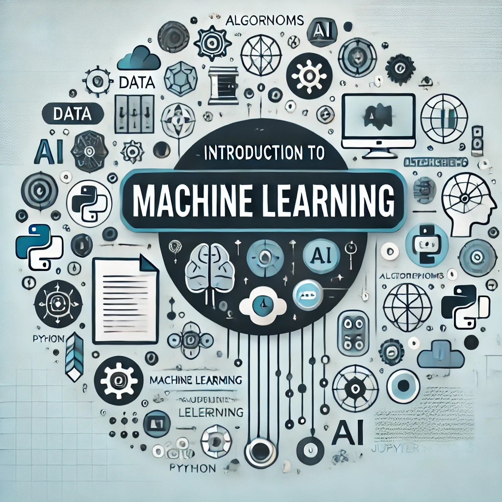

# Introduction to Machine Learning: One-Day Course 
[](https://doi.org/10.5281/zenodo.14249784) 


  


**A beginner-friendly one-day Machine Learning (ML) course covering fundamental concepts with hands-on examples.** 

---

## 📌 Overview  
This course introduces the basics of **Supervised & Unsupervised Learning** using Python and Scikit-learn.  
You'll explore **Regression, Classification, Clustering, Dimensionality Reduction**, and **Anomaly Detection** through interactive Jupyter Notebooks.  

📄 **Slides**: [Presentation](presentation/ML_intro.pdf)  
📂 **Notebooks**: [Course Materials](notebooks/)  
📘 **Detailed Course Content**: [COURSE_CONTENT.md](COURSE_CONTENT.md)  

This course has been prepared as part of the course [**"Introduction to Digital Resources"**](https://www.chalmers.se/en/infrastructure/ecommons/training-and-education/introduction-to-digital-resources/) conducted by [**Chalmers e-Commons**](https://www.chalmers.se/en/infrastructure/ecommons/).

---

<div align="center">
    
    <p><em>Image generated by AI</em></p>
</div>

---

## Quickstart: Run on using GitHub Codespaces or Marimo or Locally
You can run the course notebooks on GitHub Codespaces, Marimo, or locally on your machine.


### **Run on GitHub Codespaces**  
Click **Code > Open with Codespaces** and start immediately!  

### **Run on Marimo**  
1️⃣ Create a virtual environment following the instructions in [HOW_TO_CREATE_ENV.md](HOW_TO_CREATE_ENV.md)

2️⃣ Run Marimo Book:  
Quick start:
```sh
cd marimo_book
./start_book.sh
```
or for Windows:
```sh
cd marimo_book
start_book.bat
```
Then select **Option 1** to open the interactive index.
```sh
marimo edit 0-Index.py
```


### **Run Locally**  
1️⃣ Create a virtual environment following the instructions in [HOW_TO_CREATE_ENV.md](HOW_TO_CREATE_ENV.md)

2️⃣ Run Jupyter Notebook:  
```sh
jupyter notebook
```
3️⃣ Open the Jupyter Notebook in your browser and start learning!

---

## 📦 Dependencies  
| Package  | Version  |  
|----------|----------|  
| Python   | 3.11+     |  
| NumPy    | 1.24.0   |  
| Pandas   | 2.0.0   |  
| Scikit-learn | 1.3.0 |  
| Matplotlib | 3.7.0 | 
| Seaborn | 0.12.0 |
| Jupyter | 1.0.0 |
| joblib | 1.3.0 |
| Marimo | 0.17.0 |
  
---

## 🔖 Citation
If you use this course, please cite it using the information in [CITATION.cff](CITATION.cff).  

---

## 📜 License  
This project is licensed under the [MIT License](LICENSE.md).  

---

## Acknowledgements  
Special thanks to [**Leon Boschman**](https://github.com/lboschman) for contributing ideas, slides, and feedback.  

---
